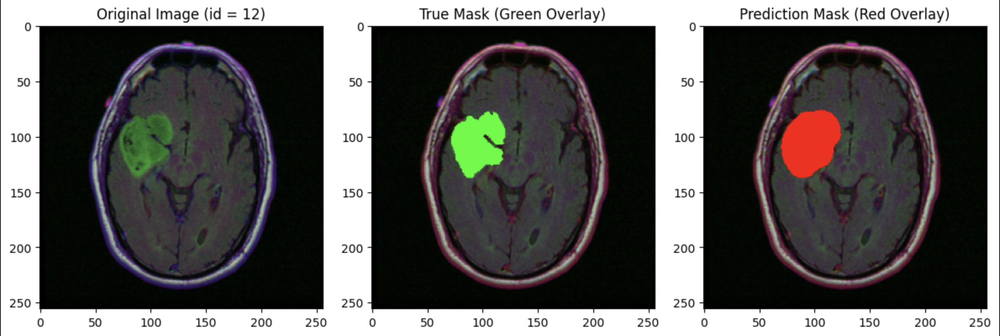

# Segmentation de tumeurs cérébrales avec des auto-encodeurs

## Description du projet

Ce projet explore l'utilisation de différentes architectures d'auto-encodeurs pour la segmentation de tumeurs cérébrales à partir de scans CT. Les architectures testées incluent **U-Net**, **LinkNet**, **FPN**, **PSPNet** et **DeepLabV3**, toutes utilisant **ResNet-18** comme encodeur. L'objectif est de comparer ces modèles en termes de temps d'entraînement, de taille du modèle, de précision et de métrique **IoU** (Intersection over Union).

## Résultats clés

- **U-Net** avec ResNet-18 a montré de bonnes performances en termes de précision et de temps d'entraînement.
- **DeepLabV3** a nécessité le plus de temps d'entraînement en raison de sa complexité, mais a également fourni des résultats précis.
- **LinkNet** s'est avéré efficace pour des tâches nécessitant une exécution rapide avec des ressources limitées.
- **ResNet-101** a amélioré les performances par rapport à ResNet-18, suggérant que des encodeurs plus complexes peuvent extraire des caractéristiques plus précises.

## Exemple de segmentation

*Image montrant un exemple de segmentation de tumeur cérébrale réalisée par l'un des modèles.*

## Auteur

- **Nicolas Melaerts** - Développeur du projet.

## Références

- **U-Net**: [Article original](https://arxiv.org/pdf/1505.04597)
- **PSPNet**: [Article original](https://onlinelibrary.wiley.com/doi/pdf/10.1155/2022/8958154)
- **FPN**: [Article original](https://link.springer.com/content/pdf/10.1186/s12880-023-01131-1.pdf)
- **LinkNet**: [Article original](https://pdf.sciencedirectassets.com/280203/1-s2.0-S1877050923X00027/1-s2.0-S1877050923000534/main.pdf)
